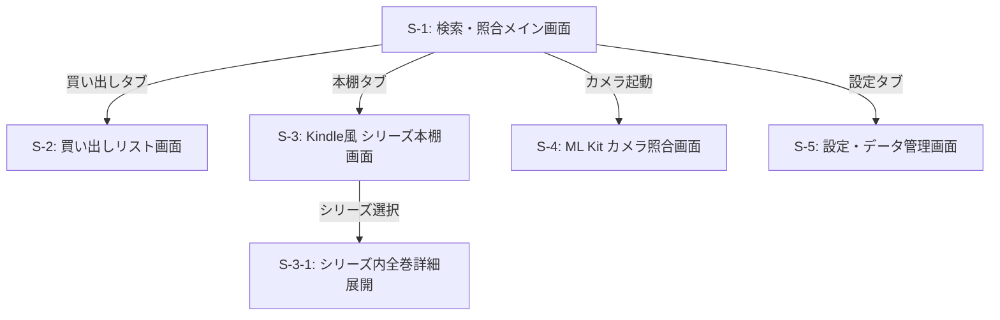

# 中古本重複購入防止・買い出し支援 Androidアプリ システム仕様書

- **文書バージョン**: v1.1.0 (Kindle風本棚機能追加版)
- **更新日**: 2026-07-28
- **対象プラットフォーム**: Android (API Level 26+ / Android 8.0以降)
- **ステータス**: 要件確定

---

## 1. プロジェクト概要

### 1.1 アプリ名
**ShelfCheck for Android** （シェルフチェック）

### 1.2 目的・コンセプト
中古本（マンガ・ラノベ・文庫本など）の購入時における**「二重購入（重複購入）」をゼロにする**ための、Android特化型買い物＆蔵書管理アプリ。

**Kotlin + Jetpack Compose** を採用し、**「テキスト/音声の0.05秒インクリメンタル検索」**、**「Kindleライブラリ風 シリーズ集約本棚」**、および **「Google ML Kit によるオンデバイスカメラ照合」** を兼ね備えた、店舗での片手親指操作に特化した最速買い物ポッドとして設計する。

---

## 2. 主要機能要件 (Functional Requirements)

### F-1: ダブル入力照合エンジン
1. **テキスト/音声あいまい検索 (メイン)**:
   - 検索バーに1文字打った瞬間、または音声マイクに話しかけた瞬間に作品候補と巻数状態を表示。
2. **Google ML Kit カメラ照合 (サブ/選択式)**:
   - CameraX + ML Kit Barcode Scanning により、カメラをかざした瞬間にISBNバーコードを0.05秒で識別・照合。

### F-2: 4色ステータス判定 ＆ 全画面アラート
- 🟥 **所持済み (Owned)**: 画面が赤 ＋ パルス振動。重複購入警告。
- 🟩 **買い出し対象 (Wanted)**: 画面が緑 ＋ 成功振動。探していた抜け巻（購入推奨）。
- 🟧 **売却済み (Sold)**: 画面がオレンジ。過去に読んで手放した本の再購入注意。
- ⬜ **未所持 / 未登録 (Unregistered)**: 画面がグレー/ブルー。

### F-3: Kindleライブラリ風 シリーズ集約本棚 (Bookshelf Library) 【新機能】
1. **シリーズ集約表示**:
   - 蔵書が個別の本ではなく、Kindleライブラリのように**「作品シリーズ単位」でアルバム風カード表示**される。
   - 代表表紙画像 (3:4) ＋ タイトル ＋ 著者 ＋ **所持進捗プログレス（例: 5/26巻 所持）**を表示。
2. **シリーズ内全巻グリッド展開**:
   - シリーズカードをタップすると、Kindleのようにその作品の全巻（1巻〜最新巻）がグリッド展開。
   - 所持・未所持・買い出し対象の巻が視覚的なカバー/ブロックで一目瞭然。
3. **本棚フィルタリング**:
   - `[すべて]` `[連載中]` `[完結済み]` `[買い出し対象あり]` タグで並び替え・絞り込み可能。

### F-4: 買い出しリスト (Shopping Mode)
1. 集めているシリーズの「未所持・抜け巻」を自動抽出してリスト化。
2. 店頭で購入したら「買った！」ボタンをワンタップで所持済みへ移行。

### F-5: オフライン & バックアップ
1. **Room Database (SQLite)** で端末内に完結。
2. JSONバックアップ・リストア機能。

---

## 3. 画面構成 (Screen Architecture)

